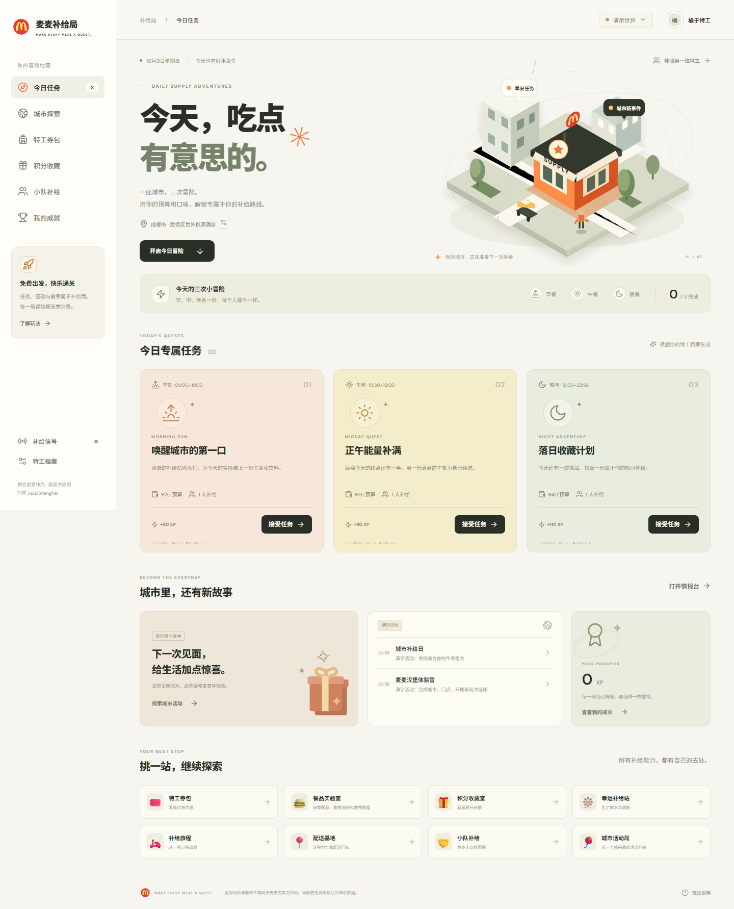

# 麦麦补给局 · 1024 M-CODE

**把一天的三顿饭，变成三场属于你的补给冒险。**

《麦麦补给局》是一个由麦当劳中国 MCP 驱动的配餐策略网页应用。每人在北京时间每天获得早餐、午餐、晚餐三份任务：在个人预算、餐次和营养条件下装配餐品卡牌，与约束求解器比较路线，再用门店服务验价通关。不必消费，也能获得应用内经验与虚拟徽章。

城市大厅采用本地 SVG/CSS 插画，连接补给工坊、积分藏宝阁、幸运站、优惠、配送、团餐、官方活动与订单旅程。默认演示模式覆盖 35 项工具能力；连接个人 MCP Token 后使用官方实时工具。真实交易始终经过预览与用户确认，支付在官方页面完成。



## 快速开始

需要 **Node.js 24 或以上版本**：

```bash
npm install
npm run dev
```

打开 [http://localhost:3000](http://localhost:3000)，无需 Token 即可玩演示。默认位置为「成都市武侯区世外桃源酒店」。生产运行使用 `npm run build`，再执行 `npm start`。

**先玩一局：**选择今日任务 → 选择补给门店 → 添加主食和饮料，或生成三条搭配路线 → 验价 → 完成任务。修改个人预算与偏好后，明天的三份任务使用新规则；今天的任务不会因刷新或设置改动重抽。

完整使用步骤见 [体验指南](docs/APP_GUIDE.md)，技术实现与限制见 [架构说明](docs/ARCHITECTURE.md)。

## 好玩的部分

- **每天三餐，个人任务种子。** 任务按身份、北京日期、餐次生成并持久化。预算余量、目标、故事与奖励组合变化；每个人的进度独立，同一天的挑战保持稳定。
- **餐品卡牌与搭配路线。** 用本店菜单装配补给箱，比较省钱、蛋白优先和丰富搭配方案。算法使用可复现的约束搜索，当前不另接语言模型。
- **能说明原因的验价。** 展示预算、品类、餐次和营养检查；优惠和各项费用由算价接口返回。缺失营养、特调与套餐子项变化显示未核验，不伪装成完整数据。
- **消费之外也有成长。** 完成任务获得虚拟 XP、连续天数和徽章；通关不下单，虚拟奖励与官方积分独立。分享冻结菜单挑战，让好友在同一道题上与算法比较分数。
- **一座接通完整能力的城市。** 查询优惠、积分与奖品，探索配送、团餐和活动，体验订单状态流转。高级场景依据当前工具 schema 生成表单，并检查上游参数来源。

## MCP 接入与 35 项能力

在 [麦当劳 MCP 开放平台](https://open.mcd.cn/mcp) 申请个人 Token，在网页的连接设置中输入即可。服务端通过 Streamable HTTP 连接 `https://mcp.mcd.cn`，动态读取实际工具 schema。每位用户的 Token 只保存在服务端内存；服务重启后需重新连接。

| 场景 | 工具数 | 覆盖内容 |
| --- | ---: | --- |
| 时间与活动 | 2 | 官方时间、当月活动日历 |
| 门店、餐品、配送与优惠 | 12 | 附近/得来速门店、地址簿、配送门店、菜单、特调、营养、领券、卡包、本店券、算价 |
| 企业团餐 | 2 | 满减满折、助餐服务 |
| 积分与商城 | 6 | 账户、商品、SKU、兑换、商城订单列表和详情 |
| 幸运站 | 3 | 资格与本次消耗、抽一次、中奖记录 |
| 官方活动副本 | 5 | 城市、门店、日期、场次、预约 |
| 订单旅程 | 5 | 餐饮下单、状态、历史订单、取消、已有满意度奖券 |

「覆盖」指实现入口、网关和演示适配器，不代表 35 个工具都做过真实交易。演示价格、营养、积分、活动、奖品与订单均为模拟；真实只读联调与未验收交易范围见 [MCP_INTEGRATION.md](MCP_INTEGRATION.md)。

新版已通过真实门店读取与官方算价验证：磨子桥餐厅菜单 124 条、营养库 160 条，其中 18 条精确匹配；候选求解返回一份 ¥34.00、24 g 蛋白质的午餐方案。该结果仅代表当时门店与账户，实时价格会变化。

也可在兼容智能体中导入 [mcd-missions Skill](skills/mcd-missions/SKILL.md) 来解释三餐挑战与配餐决策。Skill 只解释玩法与决策逻辑，不替代网页服务端的通关与确认流程。

## 写入类工具与交易安全

应用实现了 7 个写入类工具：`create-order`、`cancel-order`、`mall-create-order`、`draw-lottery`、`auto-bind-coupons`、`party-order-create`、`delivery-create-address`。它们**不会因为浏览或推荐而被触发**，全部经过同一道确认网关。

### 确认网关

写入操作必须走完两步，中间不存在「一步直接扣款」的路径：

```text
preview(name, args)  →  返回 confirmationId + 消耗摘要 + 5 分钟过期时间
                          ↓  用户在界面上看到确切金额与消耗
execute(confirmationId)  →  复核条件后才调用官方工具
```

`previewAction` 在返回确认前先做四件事：校验参数（`validateAction`）、确认账户连接未在预览期间被替换、对「会话 + 工具名 + 参数 + 消耗」做 SHA-256 指纹、查近期是否已有同指纹操作。

### 防重复与并发

| 机制 | 实现 |
| --- | --- |
| 确认归属 | `executeAction` 校验 `confirmationId` 的 `user_id`，他人确认无法执行 |
| 会话绑定 | 预览时的 `session_id` 与执行时不一致则拒绝，避免换账户后执行旧预览 |
| 状态机 | `pending → executing → succeeded / uncertain`，非 `pending` 拒绝再次执行 |
| 账户级排他锁 | `mcp_action_locks` 表，同一账户同时只允许一笔操作处于执行或待核实状态 |
| 事务保护 | `BEGIN IMMEDIATE` + 条件更新 `WHERE state='pending'`，并发下只有一方能成功 |
| 幂等 | `succeeded` 再次调用直接返回原结果，不重复提交 |
| 重复购物车 | 5 分钟内相同 `create-order` 指纹直接复用既有确认，避免连点 |
| 过期 | 确认 5 分钟失效，过期后必须重新预览以获取当前价格与消耗 |

### 不确定结果处理

网络超时或超时不等于失败。超时的操作被标记为 `uncertain` 而**不自动重试下单**——因为重复提交可能造成重复扣款。用户必须先通过官方渠道核实真实结果，系统才允许继续。这条规则同样由`mcp_action_locks` 强制：处于 `uncertain` 状态时，账户被锁定，无法再发起任何操作。

### 演示模式下的模拟

未连接 MCP Token 时，所有工具走 `lib/demo-tools.ts` 的模拟实现。演示模式下的下单、扣积分、抽奖和兑换**不产生任何真实交易**，但同样走完整的预览 → 确认流程，以便验证交互与状态机。真实交易始终在官方页面完成支付。

### 已验证与未验证

- **已验证（演示模式）**：35 项工具完整旅程、领券、单次抽奖、商城规格、活动场次预约预览、套餐特调验价、双人小队同步、确认流程的状态机与幂等性，由自动化测试与浏览器验证覆盖。
- **已验证（真实只读）**：35 工具发现、门店菜单读取、营养匹配、门店券、餐品详情、`calculate-price` 官方验价、活动解析。
- **未验证（真实写入）**：真实扣积分、真实下单、真实抽奖、真实预约、真实领券、真实支付。这些需要写入个人账户并可能产生扣款，开发过程中未自动执行，行为以官方接口实际返回为准。

如需验证写入路径，请在官方测试条件下自行操作并核对官方记录；应用不会替你承担重复提交的后果。

## 技术要点与边界

应用使用 Next.js App Router、React、TypeScript、MCP SDK、AJV 和 Node 内置 SQLite。档案、任务、报价、确认状态和演示账户状态持久化；个人身份使用签名 HttpOnly cookie。所有金额在游戏 API 中以整数分表示。

报价绑定个人任务和数据模式，5 分钟过期；通关奖励幂等记录。网络超时导致结果不明时不自动重试下单，先核查官方记录。

当前候选求解器支持一个主食、一个饮料、可选一个小食/甜品，最多输出三条路线。它不保证任意多人分配或全局最优优惠；低预算或营养缺失可能没有可行解。城市图是玩法示意，不提供真实地图导航。好友挑战只按冻结菜单标价比较，不涉及官方优惠和交易，分享链接依赖运行服务保存的快照。

本地数据默认保存在 `data/mcmissions.sqlite`，会话密钥保存在 `data/session.key`，均不进入 Git。可通过 `MCMISSIONS_DATA_DIR` 配置持久化目录。当前结构面向单个 Node 服务；无持久磁盘的 Serverless 或多实例部署需要改造存储与连接管理。

## 验证与项目结构

```bash
npm test
npm run typecheck
npm run build
```

游戏测试覆盖北京换日、三餐任务稳定与身份差异、预算上限、报价和数量校验、营养缺失与特调、候选路线及不可行菜单。MCP 测试覆盖演示业务和确认流程。真实扣积分、下单、抽奖、预约、取消与支付未由本次开发自动执行。

当前 **35 项自动化测试通过**，TypeScript 检查和生产构建通过。GitHub Actions 在 Node.js 24 下运行测试、类型检查和构建，工作流见 [ci.yml](.github/workflows/ci.yml)。本地端到端验证记录（运行时接口、会话安全、约束求解三条路线）见 [docs/acceptance.md](docs/acceptance.md)。

其中若干用例直接针对安全边界，可作为设计验证的参考：

| 用例 | 验证的约束 |
| --- | --- |
| a live write timeout is never retried and keeps a persistent uncertainty lock | 真实写操作超时后不重试，且持续持有不确定锁 |
| a live quote cannot survive reconnection to another token even if the mode stays live | 换Token 后旧报价立即失效，即使模式标记未变 |
| an in-flight old-account read cannot populate the new-account observations | 旧账户的在途读取不会污染新账户数据 |
| server quotes and missions belong to a single profile | 报价与任务绑定同一份档案 |
| failed nutrition checks, expired quotations and previous-day missions cannot earn a reward | 营养不达标、报价过期、跨日任务均不给奖励 |
| signed profile cookies round-trip and cannot be reassigned or forged | 签名 Cookie 防重放与伪造 |
| foreign origins, different ports and explicit cross-site requests are rejected | 跨站请求被拒 |
| profile updates cannot reroll persisted daily missions | 改档案不会重掷已持久化的当日任务 |
| each meal earns its server reward exactly once | 每餐奖励幂等 |
| all 35 demo scenes form valid account, delivery, mall and party journeys | 35 个工具的演示旅程全部成环 |

浏览器已验证演示三餐求解、验价和通关、演示订单、进度持久化、身份切换及移动端布局；好友挑战已通过无 cookie 访问、同卡组评分、伪造餐品拒绝和不授予 XP 的验证。领券、单次抽奖、商城规格、活动场次预约预览、套餐特调验价和双人小队同步也已通过演示验证。网页真实读取与官方算价结果另见上文 MCP 联调范围。

```text
app/                              网页与游戏 / MCP API
components/                       城市插画、弹窗、能力场景
lib/game.ts                       个性化任务与约束求解
lib/repository.ts                 档案 / 任务 / 报价 / 通关
lib/mcp.ts、lib/actions.ts         MCP 网关与确认状态
lib/demo-tools.ts                 35 项工具模拟业务
tests/                            游戏与 MCP 业务测试
skills/mcd-missions/               三餐任务助手 Skill
docs/APP_GUIDE.md                  体验指南
docs/ARCHITECTURE.md               技术架构与能力映射
MCP_INTEGRATION.md                 版本范围、schema 与真实联调记录
workbuddy.md                      原版 WorkBuddy 开发历史
CONTEST_DECLARATION.md             官方参赛声明原文
```

## 开发历史与参赛

仓库原版 Skill 和只读联调在腾讯 WorkBuddy 中完成，历史记录保留于 [workbuddy.md](workbuddy.md) 与 [原版验收记录](docs/acceptance.md)。本轮《麦麦补给局》网页、任务引擎、MCP 网关和演示业务由 Codex 实现；原版历史不代表新版交易功能已经实测。

项目用于参加 [麦当劳程序员创意开发大赛](https://github.com/M-China/mcd-developer-innovation-challenge)。报名及排名时间为 **2026 年 10 月 9 日 10:30 至 10 月 25 日 23:59（北京时间）**，以 [官方规则](https://github.com/M-China/mcd-developer-innovation-challenge/blob/main/activityGuidelines.md) 为准。[报名正文](docs/registration-issue.md) 与 [提交检查](docs/submission-readiness.md) 属于原版存档，提交前须按当前项目更新并复核；创建仓库和提交代码不等于报名成功。

本项目为独立开发作品，非麦当劳官方产品。餐品信息、价格、权益与供应以官方实时结果为准。项目原创代码、Skill 与文档采用 [MIT License](LICENSE)；官方材料与第三方商标、服务和素材归其权利人所有。
