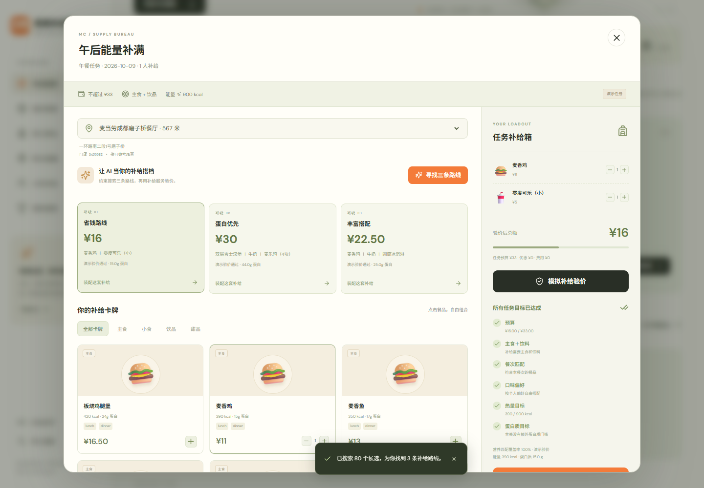
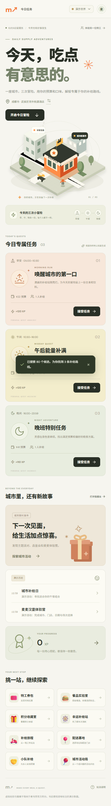
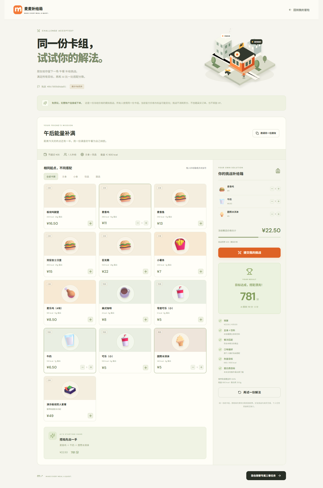

# 《麦麦补给局》体验指南

每天在北京时间凌晨刷新早餐、午餐、晚餐三份个人任务。任务由你的档案与日期决定，同一天刷新不会重抽。换一个演示身份可以看到另一组挑战，昵称、预算和口味设置也会参与后续体验。

## 启动

需要 Node.js 24 或以上版本和 npm：

```bash
npm install
npm run dev
```

打开 [http://localhost:3000](http://localhost:3000)。生产运行使用 `npm run build` 后执行 `npm start`。应用默认进入演示模式，不需要麦当劳 Token。默认位置是成都市武侯区世外桃源酒店。

## 两分钟体验主线

1. 在任务大厅选择早餐、午餐或晚餐，查看预算、营养门槛和奖励。
2. 进入城市补给站，查询门店并选择一家，加载该门店菜单。
3. 在补给工坊添加主食、饮料，按需选择小食；尝试候选搭配查看省钱、蛋白优先、丰富搭配三条路线。
4. 提交验价，查看真实试算结果或明确标注的演示试算，以及预算、餐次和营养检查。
5. 所有条件通过后完成任务，获得应用经验与虚拟徽章。相同任务只能领取一次通关奖励。

通关无需购买。任务中的经验与徽章属于《麦麦补给局》，不等于麦享会积分，也不是官方优惠权益。界面的「AI 搭配」当前使用确定性算法，未接入独立语言模型服务。



手机上也能完成同样流程，菜单和任务卡会随屏幕宽度调整。



## 每个人的三餐任务

首次打开后，应用为当前浏览器创建独立档案并保存每日任务。同人、同天、同餐次的故事和规则稳定；新一天产生新任务。不同身份具有独立种子，故事模板可能偶尔重复，但任务身份和进度互不混用。

档案可设置城市、位置、每餐预算、口味及营养目标。预算范围是每餐 ¥5–¥1000。保存后昵称和位置即时更新，预算、口味和营养规则用于明天的新任务，不重刷今天已生成的任务。低预算和有限菜单可能没有满足所有条件的方案，可以次日调整规则再挑战。

「不吃辣」用于过滤配餐；「蛋白优先」「只想省钱」「多样搭配」决定任务目标。其他口味标签目前用于档案记录，没有单独的通关门槛。

个人档案目前保存在浏览器身份 cookie 对应的服务端 SQLite 数据中，没有跨设备登录。清除浏览器 cookie 会进入新身份；开发时使用「切换身份」是体验另一组演示挑战，不能找回其他浏览器的档案。

## 演示与真实连接

演示模式模拟全部 35 个 MCP 工具，可以体验领券、抽奖、积分兑换、派对预约、订单查询和取消流程。价格与营养是演示值，积分与订单也是模拟，演示付款不会产生真实交易。

真实模式需要个人麦当劳 MCP Token，可在 [麦当劳 MCP 开放平台](https://open.mcd.cn/mcp) 申请。在页面连接设置中填写 Token 后，应用服务端与官方 MCP 建立连接。Token 仅留在服务端内存，服务重启后需重新连接。不要将 Token 提交到 GitHub、聊天记录或分享文件。模式切换后重新选择门店和验价，旧模式的报价不能用于新模式通关或下单。

营业状态、供应、活动资格、库存与费用以官方实时结果为准。城市图是玩法示意，门店距离只是接口参考值，不提供真实导航。官方活动日历当前覆盖当月，跨月信息无法据此推断。

## 全部能力怎么体验

| 场景 | 可以做什么 |
| --- | --- |
| 城市与餐品工坊 | 附近门店、得来速、菜单、套餐详情、特调、营养与官方验价 |
| 优惠 | 可领权益、领券、卡包和本店可用券；用本店券重新验价 |
| 配送与团餐 | 地址簿、添加地址、可配送门店、企业团餐满减满折和助餐服务 |
| 积分藏宝阁 | 积分余额、到期积分、商城列表、SKU 规格与购买条件、兑换和商城订单 |
| 幸运站 | 活动资格、本次消耗、抽奖一次和历史奖品 |
| 官方活动副本 | 从活动商品依次选择城市、门店、日期、场次并预览预约 |
| 订单旅程 | 餐饮下单预览、订单列表、状态、取消和本人已有满意度奖券 |
| 活动日历 | 当前服务时间与当月官方活动 |

部分高级能力使用按实际 MCP schema 生成的表单，须先完成上游查询再填入真实编码。活动预约不能自行编造城市、门店、日期或场次。工具清单及架构映射见 [ARCHITECTURE.md](ARCHITECTURE.md)。

## 看懂验价与营养

购物车菜单金额是估计，优惠、配送费、包装费、餐具费以验价返回为准。有效报价保存 5 分钟，过期后重新验价。修改餐品、数量、特调或优惠券后，再验价才得到当前方案的判定。更换 Token 或重新连接后，也须重新查询菜单和报价。

营养覆盖率表示当前配餐有多少「份」具有可核验的热量与蛋白质。营养只匹配名称完全一致的标准餐品；缺值、套餐子项变更和特调后会显示未知，未知不会当作 0 kcal。热量或蛋白质无法核验时，可能无法通关，不能根据估计营养承诺满足目标。

候选算法支持一人、一个主食、一杯饮品、可选一个小食/甜品，提供最多三条不同路线。它会说明没有可行解的情况，不保证穷尽全部组合或得到理论最优优惠。多人团餐和复杂套餐可通过对应场景查询与试算。

## 与朋友挑战同一道题

分享任务可生成一张冻结任务和菜单的挑战卡及好友链接。好友使用卡上的同一份菜单组配，提交后与已保存的算法路线比较分数。该页面使用冻结菜单标价，属于玩法比较，不是官方报价，不产生购买和原任务 XP。

链接依赖当前运行服务保存的快照。将应用部署到朋友可以访问的地址后才能分享在线链接；本地 `localhost` 地址只能在本机访问。菜单价格和供应随后可能改变，挑战结果不能用于真实消费承诺。没有已加载菜单时，挑战使用演示菜单并标注来源。

好友无需 Token 或已有身份 cookie 即可打开挑战和提交解法。挑战从服务端快照核算，伪造餐品无法通过验证。



## 真实写操作

领券、添加配送地址、餐饮下单、积分兑换、活动预约、抽奖和取消订单都经过「预览 → 展示操作及消耗 → 确认执行」。推荐或通关不自动执行交易。抽奖先展示此次消耗的是机会还是积分，用户确认才抽一次。

餐饮支付由用户打开官方返回的支付入口完成。写操作网络超时或结果不明时，应用不会自动再次下单；先查询订单记录，避免重复交易。同一确认重复点击只处理一次。

完成一次抽奖、兑换等操作后，如想再参与，需要重新预览并单独确认一次。相同餐饮下单短时间内会复用已有确认，避免重复创建订单。

结果不明时会锁定该账户后续写操作，查询仍可继续。当前需要人工核查官方结果后维护恢复，页面尚未提供自助解除锁定。

本版开发验收覆盖算法、接口、演示数据与页面流程，并在 2026-10-09 通过网页服务端实测门店菜单、营养、门店券、详情、算价、候选求解和活动日历。没有执行真实扣积分、抽奖、下单、预约、取消或支付验收。结果与历史只读记录见 [MCP_INTEGRATION.md](../MCP_INTEGRATION.md)。

## 数据与开发检查

档案、任务、进度和演示状态默认保存在本地 `data/mcmissions.sqlite`，个人会话签名密钥保存在 `data/session.key`。通过 `MCMISSIONS_DATA_DIR` 指定持久化目录；请备份所需数据，并让该目录仅由应用服务读写。数据库和会话密钥不应上传到仓库。

```bash
npm test
npm run typecheck
npm run build
```

本轮 35 项自动化测试、类型检查与生产构建通过；浏览器已验证三餐通关、演示订单、进度刷新持久化、身份切换、匿名好友挑战与移动端无横向溢出。仓库的 [GitHub Actions](../.github/workflows/ci.yml) 使用 Node.js 24 重复执行测试、类型检查和构建。

如真实连接失败，检查 Token 是否过期、网络和官方服务状态。查询失败会显示错误，不能当作「没有门店/没有优惠」。无实时数据时，可断开连接返回演示模式继续体验，但模拟数据不能用于真实消费决策。
