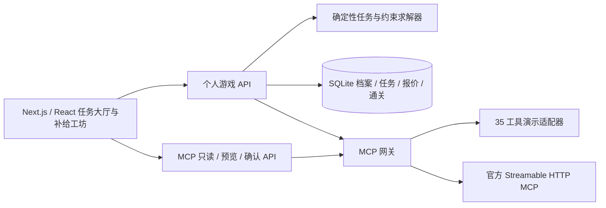

# 《麦麦补给局》架构与验证边界

《麦麦补给局》把门店、菜单、官方算价与麦享会能力编排成配餐挑战。游戏主线是「每日三餐任务 → 配餐 → 约束求解 → 验价 → 通关」，任务通关不要求购买餐品。任务经验和徽章是应用内虚拟奖励，不能兑换麦享会积分。

## 技术结构

前端使用 Next.js App Router、React、TypeScript 与 Lucide 图标。城市由本地 SVG/CSS 绘制，门店节点表示玩法入口；它不是地图或真实导航。当前候选求解器是确定性的 TypeScript 算法，没有另接大语言模型，界面中的「AI 搭配」由可复现的约束搜索生成。

后端分工如下：

| 模块 | 职责 |
| --- | --- |
| `lib/game.ts` | 北京日期、个人三餐任务、购物车营养合计、任务判定、三条候选路线 |
| `lib/repository.ts` | 档案校验、每日任务持久化、服务端报价、幂等通关、经验与连续天数 |
| `lib/db.ts` | Node 内置 SQLite、WAL、本地数据目录 |
| `lib/user.ts` | 当前浏览器个人档案身份与请求来源校验 |
| `lib/mcp.ts` | 个人 MCP 连接、工具列表、官方调用和演示路由 |
| `lib/mcd-normalize.ts` | JSON/TOON 数据解析与门店、菜单、营养、费用归一化 |
| `lib/actions.ts` | 写操作预览、消耗摘要、确认状态和重复执行防护 |
| `lib/tool-catalog.ts`、`lib/demo-tools.ts` | 35 项能力的演示 schema 与持久化模拟业务 |

## 每人每天三餐任务

日期固定按 `Asia/Shanghai` 计算，北京时间凌晨 00:00 换日，与服务器运行时区无关。早餐、午餐、晚餐各有一份任务。种子由个人身份、北京日期与餐次产生，因此同人同天同餐次刷新得到同一任务，各人的任务身份与种子独立；任务还会变化故事、预算余量、目标与奖励。故事模板可能重复，不保证所有人的标题都互不相同。

数据库对 `(user_id, date, slot)` 使用唯一约束。当天第一次生成三餐任务时保存档案目标的快照，之后修改预算、口味或营养目标不会重刷当天任务，次日任务使用新设置。档案昵称与位置可以即时更新。当前身份由浏览器 cookie 表示，不是跨设备账号登录；清除 cookie 或切换演示身份会进入另一份档案。

每餐预算接口单位是整数「分」，页面显示「元」。合法档案预算为每餐 ¥5–¥1000。任务预算不超过用户上限；低预算或门店菜单限制可能没有可行解，程序返回空候选，不能编造餐品或承诺所有关卡都有解。卡片上的餐次时间是玩法说明，不替代门店实时菜单、营业和供应校验。

「不吃辣」作为配餐硬过滤；「蛋白优先」「只想省钱」「多样搭配」改变次日任务目标。其余口味标签记录于档案，目前没有独立的硬约束。默认演示档案已用 100 个身份的 300 个三餐任务验证至少存在一条预算与营养都通过的候选，用户自行降低预算或真实菜单变化仍可能无解。

## 配餐、营养与官方验价

求解器在当前餐次的菜单中组合一个主食、一个饮料和至多一个小食/甜品，并过滤可靠营养、不吃辣偏好和营养门槛。搜索有候选数量上限，生成省钱、蛋白优先、丰富搭配三条不同路线。它不覆盖任意多人分配、无限数量、所有套餐特调和全局最优券组合。

菜单价格只是候选估计。搜索允许一定价格余量，为实际门店优惠留出空间；估计候选不会自动标为官方核验。服务端会调用 `calculate-price` 后才依据真实总价判定预算，并计入配送、包装与餐具等返回费用。商品编码和数量在服务端核验，客户端自报价格或营养不能改变通关判定。

营养仅使用餐品名称的精确匹配，不通过近似名称推断。每份同时具有热量和蛋白质且没有特调/套餐子项变更时，才算已覆盖；覆盖率按实际份数加权。缺失或调整后的营养显示未知，合计不是零，也不满足需要核验的营养门槛。没有可靠营养匹配的真实门店菜单，可能无法完成营养任务。

报价保存于服务端并绑定档案、任务、门店、数据模式与本次账户连接，有效期为 5 分钟。通关只使用该记录，不接受客户端伪造判定。重复完成同一任务只计一次奖励，旧日期任务不能计入今日进度，演示报价和真实模式不能混用；更换 Token 或重新连接后，旧账户报价失效。

## 好友挑战快照

分享挑战时，服务端冻结任务规则与菜单公开字段，并生成同一实例可访问的 `/challenge/<code>` 地址。好友在这份冻结菜单上组配，服务端按快照的菜单标价和相同营养规则重新判定，比较其分数与保存的算法基线。快照不包含 Token、账户券、地址或官方订单；没有菜单快照时使用明确标记的演示菜单。

好友挑战仅用于同题玩法比较，不调用官方验价或创建订单，也不授予原任务经验。冻结标价无法证明此刻可购买或其他人同价。链接依赖当前服务实例与 SQLite 数据，不能作为跨服务器导入文件；当前没有全局排行榜。

## 两种数据模式

默认演示模式无需 Token，35 个工具都由应用本地适配器返回模拟数据。演示门店借用展示地点，餐品价格、营养、积分、抽奖、活动和订单均是模拟；演示状态按档案隔离并存入 SQLite。模拟下单没有真实支付，不能据此声称账户交易已完成。

用户主动连接个人 Token 后，MCP 网关通过官方 `https://mcp.mcd.cn` 调用实时工具。Token 只保留在该用户的服务端内存连接中，不写入源码、SQLite 或公开挑战快照；服务重启后需要重新连接。官方工具 schema 由当前连接读取；工具响应中的文字仅按数据解析，不执行或覆盖应用逻辑。服务端切换模式后需重新加载菜单和验价。

## 35 项能力覆盖

覆盖表示应用具有对应入口、网关和演示适配能力，不等于所有真实交易已经完成验收。

| 玩法场景 | MCP 工具 |
| --- | --- |
| 时间与活动（2） | `now-time-info`、`campaign-calendar` |
| 门店、餐品、配送和优惠（12） | `query-nearby-stores`、`delivery-query-addresses`、`delivery-create-address`、`delivery-query-stores`、`query-meals`、`query-meal-detail`、`list-nutrition-foods`、`available-coupons`、`auto-bind-coupons`、`query-my-coupons`、`query-store-coupons`、`calculate-price` |
| 企业团餐（2） | `query-promotions`、`query-meal-assistance` |
| 积分与商城（6） | `query-my-account`、`mall-points-products`、`mall-product-detail`、`mall-create-order`、`mall-order-list`、`mall-order-detail` |
| 幸运站（3） | `query-lottery-info`、`draw-lottery`、`query-my-prizes` |
| 官方活动副本（5） | `query-party-city`、`query-party-store`、`query-party-store-date`、`query-party-store-session`、`party-order-create` |
| 订单旅程（5） | `create-order`、`query-order`、`order-list`、`cancel-order`、`query-survey-coupon` |

活动副本从商品详情、城市、门店、日期、场次逐层取参数。商城兑换先读取规格与购买条件。账户卡包和门店可用券分别展示，不把账户拥有的券直接视为本次可用。满意度工具只读取本人已有记录，没有代填问卷能力。

活动预约预览按 SKU 积分/现金乘人数给出估计，场次返回的 `price` 字段单位未明确时不擅自换算；最终收费及人数校验以官方创建结果为准。场次余位与最大人数都需满足，包场另核验最低人数，不从商品说明文字猜人数规则。

## 写操作与运行限制

真实领券、添加配送地址、下单、兑换、抽奖、取消和活动预约都先预览，再由用户确认执行。下单价格、业务编码、取餐方式和上游选择以实时结果为准。抽奖必须先展示 `resourceEligible` 与 `nextConsumption`，不能把 `drawPoint` 当作每次必然消耗。付款使用官方返回的支付入口，由用户在官方页面完成。

确认状态保存后再发起业务调用。重复确认同一请求不能发起第二次交易；结果不明的写操作不能自动重试，应通过订单列表或详情核查后处理。确认网关能避免应用内部重复执行，但官方未提供业务幂等键时，不能保证跨服务严格「恰好一次」。

已成功的餐饮下单在短时间内复用相同购物车与消耗的确认，避免产生重复订单。抽奖、兑换等其他已完成操作，可以在用户再次明确预览后生成新确认，但每次仍需单独执行确认，不会自动连续抽奖或兑换。

结果不明时保留该账户写操作锁，允许继续查询。当前没有自动解除或用户自行解除该锁的页面；需人工核查官方结果后维护恢复，不能通过重复点击尝试消除不确定状态。

SQLite 依赖持久化磁盘，默认保存在 `data/`，可由 `MCMISSIONS_DATA_DIR` 改位置。个人身份 cookie 使用 HMAC 签名、HttpOnly 与 SameSite=Strict；签名密钥存放于同目录的 `session.key`，HTTPS 下启用 Secure。不要把数据库、会话密钥或个人 Token 提交到 Git。当前方案适合单个 Node 服务及其本地持久化数据；无盘 Serverless 和多实例部署需要改造存储与连接管理。

## 验证范围

`tests/game.test.ts` 验证北京换日、同人任务稳定、身份差异、三餐独立、默认演示任务可解、预算上限、报价与数量边界、营养覆盖、特调失效、偏好目标、候选筛选和不可行菜单。`tests/repository.test.ts` 验证当天任务快照、次日设置、生效失败不写入、档案与报价归属、模式隔离、幂等奖励、过期报价和旧日期拒绝。`tests/user.test.ts` 验证签名 cookie 防伪、HTTPS 属性、内部监听地址与浏览器 Host 匹配，以及跨源请求拒绝。`tests/mcp.test.ts` 覆盖 35 项演示旅程、上游参数、确认幂等、隔离账户、消耗复核和模拟真实写入超时后不重试。全项目还应执行 `npm test`、`npm run typecheck`、`npm run build`，并通过页面验证任务和确认流程。

本轮 2026-10-09 约 14:55（北京时间）通过网页服务端验证官方连接、35 工具发现、磨子桥门店、124 条菜单、160 条营养记录及其中 18 条精确匹配、门店券、详情、算价、游戏候选和活动日历；午餐候选试算为 ¥34.00、蛋白质 24 g，断开后正常回到演示。具体结果和原版历史记录见 [MCP_INTEGRATION.md](../MCP_INTEGRATION.md)。它不代表本次网页版本已验收真实下单、扣积分、抽奖、预约或取消。当前开发验证不执行这些真实写操作；真实支付和现场取餐仍需后续在用户明确确认后逐项验证。

本轮浏览器验证已完成演示早餐、午餐、晚餐的候选求解、验价和通关，演示订单预览与确认，刷新后保留三次完成进度，以及切换个人档案。移动视口未出现横向溢出或页面错误。该页面验收使用演示模式，不等同真实支付验收。

好友挑战浏览器验收已通过匿名读取和提交、冻结卡组与基准同分、拒绝伪造餐品、不授予任务 XP，以及移动端无横向溢出和页面错误。本轮 35 项自动化测试、TypeScript 检查和生产构建通过。持续集成见 [.github/workflows/ci.yml](../.github/workflows/ci.yml)，在 Node.js 24 下执行 `npm test`、`npm run typecheck`、`npm run build`；本地通过不意味着尚未运行的远端 CI 已成功。
